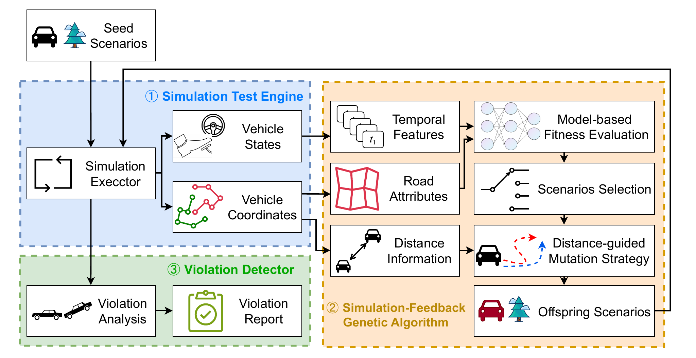








I am a Ph.D. student at Nanjing University of Aeronautics and Astronautics, supervised by Professor [Yu Zhou](https://csyuzhou.github.io/). I received my Master's degree from Beijing Information Science and Technology University, under the supervision of Professor [Zhanqi Cui](https://zqcui.github.io/).

My research interests include Software Analysis and Testing, focusing on Autonomous Driving Systems and Blockchain Smart Contracts. Please feel free to contact me if you're interested. 🙌

# 🔥 News
- *2025.06*: &nbsp;🎉🎉 One paper is accepted by TOSEM! [Autonomous Driving System, Fuzzing]
- *2025.01*: &nbsp;🎉🎉 One paper is accepted by 软件学报! [Smart Contract, Symbolic Execution]

# 📝 Publications 

  TOSEM

[SimADFuzz: Simulation-Feedback Fuzz Testing for Autonomous Driving Systems](https://dl.acm.org/doi/10.1145/3744242)

**Huiwen Yang**, Yu Zhou, Xiang Chen

- 
  软件学报
  

  **基于目标制导符号执行的智能合约安全漏洞检测**
  
  
  Smart Contract
  

     <strong><em>杨慧文</em></strong>, 崔展齐, 陈翔, 郑丽伟, 刘建宾.
    软件学报, 2025. (中文CCF-A)

    📃[**Paper**](https://www.jos.org.cn/jos/article/abstract/7396)

- 
  SCP
  
  **Integrating Behavioral Semantic Analysis in Usage-Based Equivalent Tests Generation for Mobile Applications**

     Shuqi Liu, Yu Zhou, <strong><em>Huiwen Yang</em></strong>, Tingting Han, Taolue Chen.
    Science of Computer Programming, 2025. (国际CCF-B)

    📃[**Paper**](https://doi.org/10.1016/j.scico.2024.103261)

- 
  软件学报
   
  **智能合约安全漏洞检测研究进展**

     崔展齐, <strong><em>杨慧文</em></strong>, 崔展齐, 陈翔, 王林章.
    软件学报, 2024. (中文CCF-A, 导师一作)

    📃[**Paper**](https://www.jos.org.cn/jos/article/abstract/7046)

- 
  SCP
  
  **CrossFuzz: Cross-contract fuzzing for smart contract vulnerability detection**

     <strong><em>Huiwen Yang</em></strong>, Xiguo Gu, Xiang Chen, Liwei Zheng, Zhanqi Cui.
    Science of Computer Programming, 2024. (国际CCF-B)

    📃[**Paper**](https://doi.org/10.1016/j.scico.2023.103076)

- 
  IET Software
   [DevOps]**CIDFuzz: Fuzz Testing for Continuous Integration**

     Jiaming Zhang, Zhanqi Cui, Xiang Chen, <strong><em>Huiwen Yang</em></strong>, Liwei Zheng, Jianbin Liu.
    IET Software, 2023. (国际CCF-B)

    📃[**Paper**](https://dl.acm.org/doi/10.1049/sfw2.12125)

- 
  IJSEKE
   **OC-Detector: Detecting Smart Contract Vulnerabilities Based on Clustering Opcode Instructions**

     Xiguo Gu, Liwei Zheng, <strong><em>Huiwen Yang</em></strong>, Shifan Liu, Zhanqi Cui.
    International Journal of Software Engineering and Knowledge Engineering, 2023. (国际CCF-C)

    📃[**Paper**](https://doi.org/10.1142/S0218194023410061)

- 
  SEKE
   **Smart Contract Vulnerability Detection Based on Clustering Opcode Instructions**

     Xiguo Gu, <strong><em>Huiwen Yang</em></strong>, Shifan Liu, Zhanqi Cui.
    International Conference on Software Engineering and Knowledge Engineering, 2023. (国际CCF-C)

    📃[**Paper**](https://doi.org/10.1142/S0218194023410061)

- 
  软件学报
  
  **基于软件度量的Solidity智能合约缺陷预测方法**

     <strong><em>杨慧文</em></strong>, 崔展齐, 陈翔, 贾明华, 郑丽伟, 刘建宾.
    软件学报, 2022. (中文CCF-A)

    📃[**Paper**](https://www.jos.org.cn/jos/article/abstract/6550)

# 🎖 Honors and Awards
- *2023* Outstanding Graduation Thesis. 
- *2022* Graduate National Scholarship. 
- *2022* Graduate Academic Scholarship Third Prize.
- *2021* Graduate Academic Scholarship Third Prize.

# 📖 Educations
- *2023.09 - (now)*, PhD in Software Engineering, Nanjing University of Aeronautics and Astronautics. 
- *2020.09 - 2023.06*, Master in Computer Technology, Beijing Information Science and Technology University. 
- *2016.09 - 2020.07*, Undergraduate in Software Engineering. Beijing Information Science and Technology University. 

[//]: # (# 💬 Invited Talks)

[//]: # (- *2021.06*, Lorem ipsum dolor sit amet, consectetur adipiscing elit. Vivamus ornare aliquet ipsum, ac tempus justo dapibus sit amet. )

[//]: # (- *2021.03*, Lorem ipsum dolor sit amet, consectetur adipiscing elit. Vivamus ornare aliquet ipsum, ac tempus justo dapibus sit amet.  \| [\[video\]]&#40;https://github.com/&#41;)

[//]: # (# 💻 Internships)

[//]: # (- *2019.05 - 2025.02*, [Lorem]&#40;https://github.com/&#41;, China.)